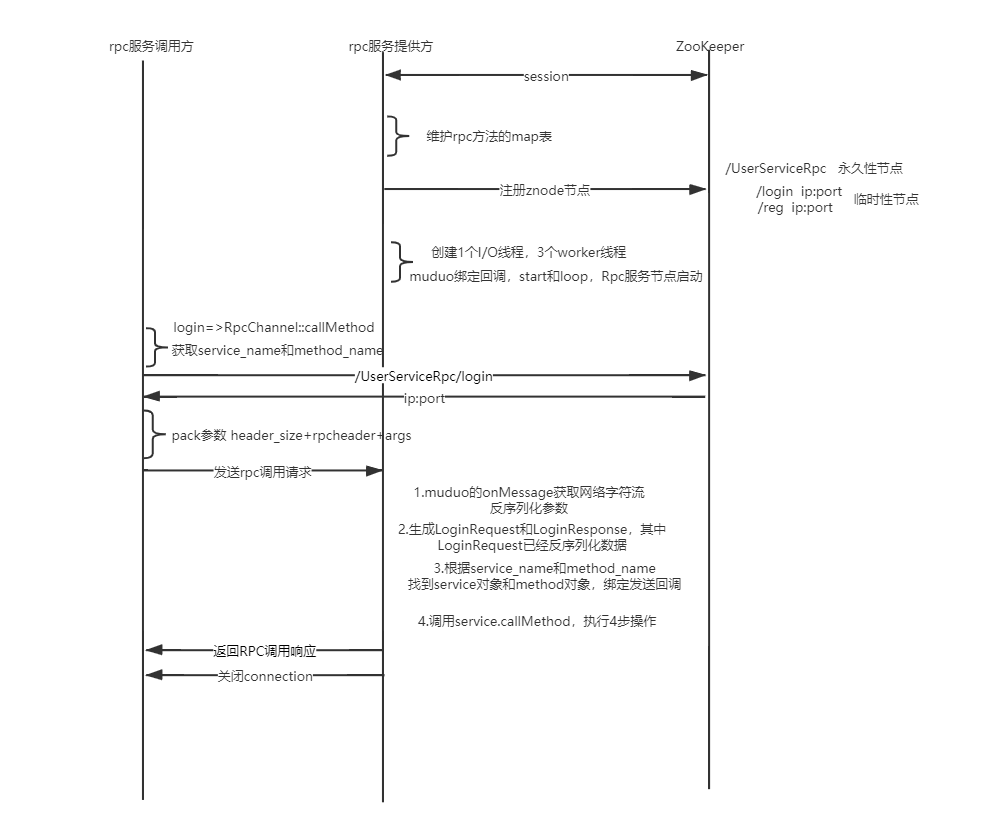

RPC分布式网络通信框架 (MPRPC)
====
Introduction
-------
该项目网络层基于高并发的Reactor网络模型muduo开源网络库实现，可以比较好的对网络IO层和RPC方法调用处理层进行代码解耦。RPC方法调用通过protobuf进行相关数据的序列化和反序列化，在同构和异构系统中都可以直接进行调用。基于zookeeper实现微服务的服务注册、服务发现。

Envoirment
-------
* OS: Ubuntuserver 18.04
* Complier: gcc 7.5
* Zookeeper 3.4.10
* Protobuf 3.11.0
* Cmake 3.10.2 

Build
-------
```
./autobuild.sh
```

Technical points
-------
* 集群和分布式概念以及原理
* RPC远程过程调用原理以及实现
* Protobuf数据序列化和反序列化协议
* ZooKeeper分布式一致性协调服务应用以及编程
* Muduo网络库编程
* 异步日志系统
* CMake项目集成编译环境

Project Interaction Diagram
-------



```
mprpc
├─ .vscode
│  └─ settings.json
├─ CMakeLists.txt
├─ README.md
├─ bin
│  ├─ 2023-6-23-log.txt
│  ├─ 2023-7-8-log.txt
│  ├─ consumer
│  ├─ provider
│  └─ test.conf
├─ build
│  ├─ CMakeCache.txt
│  ├─ CMakeFiles
│  │  ├─ 3.10.2
│  │  │  ├─ CMakeCCompiler.cmake
│  │  │  ├─ CMakeCXXCompiler.cmake
│  │  │  ├─ CMakeDetermineCompilerABI_C.bin
│  │  │  ├─ CMakeDetermineCompilerABI_CXX.bin
│  │  │  ├─ CMakeSystem.cmake
│  │  │  ├─ CompilerIdC
│  │  │  │  ├─ CMakeCCompilerId.c
│  │  │  │  ├─ a.out
│  │  │  │  └─ tmp
│  │  │  └─ CompilerIdCXX
│  │  │     ├─ CMakeCXXCompilerId.cpp
│  │  │     ├─ a.out
│  │  │     └─ tmp
│  │  ├─ CMakeDirectoryInformation.cmake
│  │  ├─ CMakeOutput.log
│  │  ├─ CMakeTmp
│  │  ├─ Makefile.cmake
│  │  ├─ Makefile2
│  │  ├─ TargetDirectories.txt
│  │  ├─ cmake.check_cache
│  │  ├─ feature_tests.bin
│  │  ├─ feature_tests.c
│  │  ├─ feature_tests.cxx
│  │  └─ progress.marks
│  ├─ Makefile
│  ├─ cmake_install.cmake
│  ├─ compile_commands.json
│  ├─ example
│  │  ├─ CMakeFiles
│  │  │  ├─ CMakeDirectoryInformation.cmake
│  │  │  └─ progress.marks
│  │  ├─ Makefile
│  │  ├─ callee
│  │  │  ├─ CMakeFiles
│  │  │  │  ├─ CMakeDirectoryInformation.cmake
│  │  │  │  ├─ progress.marks
│  │  │  │  └─ provider.dir
│  │  │  │     ├─ CXX.includecache
│  │  │  │     ├─ DependInfo.cmake
│  │  │  │     ├─ __
│  │  │  │     │  └─ friend.pb.cc.o
│  │  │  │     ├─ build.make
│  │  │  │     ├─ cmake_clean.cmake
│  │  │  │     ├─ depend.internal
│  │  │  │     ├─ depend.make
│  │  │  │     ├─ flags.make
│  │  │  │     ├─ friendservice.cc.o
│  │  │  │     ├─ link.txt
│  │  │  │     └─ progress.make
│  │  │  ├─ Makefile
│  │  │  └─ cmake_install.cmake
│  │  ├─ caller
│  │  │  ├─ CMakeFiles
│  │  │  │  ├─ CMakeDirectoryInformation.cmake
│  │  │  │  ├─ consumer.dir
│  │  │  │  │  ├─ CXX.includecache
│  │  │  │  │  ├─ DependInfo.cmake
│  │  │  │  │  ├─ __
│  │  │  │  │  │  └─ friend.pb.cc.o
│  │  │  │  │  ├─ build.make
│  │  │  │  │  ├─ callfriendservice.cc.o
│  │  │  │  │  ├─ cmake_clean.cmake
│  │  │  │  │  ├─ depend.internal
│  │  │  │  │  ├─ depend.make
│  │  │  │  │  ├─ flags.make
│  │  │  │  │  ├─ link.txt
│  │  │  │  │  └─ progress.make
│  │  │  │  └─ progress.marks
│  │  │  ├─ Makefile
│  │  │  └─ cmake_install.cmake
│  │  └─ cmake_install.cmake
│  └─ src
│     ├─ CMakeFiles
│     │  ├─ CMakeDirectoryInformation.cmake
│     │  ├─ mprpc.dir
│     │  │  ├─ CXX.includecache
│     │  │  ├─ DependInfo.cmake
│     │  │  ├─ build.make
│     │  │  ├─ cmake_clean.cmake
│     │  │  ├─ cmake_clean_target.cmake
│     │  │  ├─ depend.internal
│     │  │  ├─ depend.make
│     │  │  ├─ flags.make
│     │  │  ├─ link.txt
│     │  │  ├─ logger.cc.o
│     │  │  ├─ mprpcapplication.cc.o
│     │  │  ├─ mprpcchannel.cc.o
│     │  │  ├─ mprpcconfig.cc.o
│     │  │  ├─ mprpccontroller.cc.o
│     │  │  ├─ progress.make
│     │  │  ├─ rpcheader.pb.cc.o
│     │  │  ├─ rpcprovider.cc.o
│     │  │  └─ zookeeperutil.cc.o
│     │  └─ progress.marks
│     ├─ Makefile
│     └─ cmake_install.cmake
├─ example
│  ├─ CMakeLists.txt
│  ├─ callee
│  │  ├─ CMakeLists.txt
│  │  ├─ friendservice.cc
│  │  └─ userservice.cc
│  ├─ caller
│  │  ├─ CMakeLists.txt
│  │  ├─ callfriendservice.cc
│  │  └─ calluserservice.cc
│  ├─ friend.pb.cc
│  ├─ friend.pb.h
│  ├─ friend.proto
│  ├─ user.pb.cc
│  ├─ user.pb.h
│  └─ user.proto
├─ lib
│  └─ libmprpc.a
├─ src
│  ├─ CMakeLists.txt
│  ├─ include
│  │  ├─ lockqueue.h
│  │  ├─ logger.h
│  │  ├─ mprpcapplication.h
│  │  ├─ mprpcchannel.h
│  │  ├─ mprpcconfig.h
│  │  ├─ mprpccontroller.h
│  │  ├─ rpcheader.pb.h
│  │  ├─ rpcprovider.h
│  │  └─ zookeeperutil.h
│  ├─ logger.cc
│  ├─ mprpcapplication.cc
│  ├─ mprpcchannel.cc
│  ├─ mprpcconfig.cc
│  ├─ mprpccontroller.cc
│  ├─ rpcheader.pb.cc
│  ├─ rpcheader.proto
│  ├─ rpcprovider.cc
│  └─ zookeeperutil.cc
└─ test
   └─ protobuf
      ├─ a.out
      ├─ main.cc
      ├─ test.pb.cc
      ├─ test.pb.h
      └─ test.proto

```